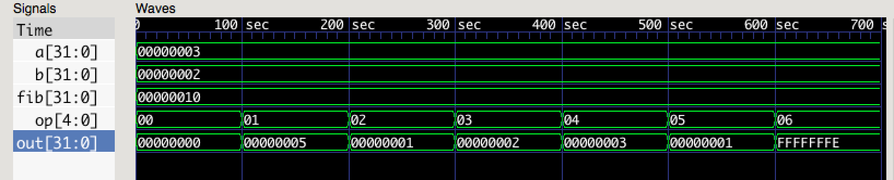

# 实验一、实现ALU

_PB16001800 吴昊_

## 实验目的

了解一下ALU的实现

## 实验内容

实现一个ALU，然后用它来完成斐波那契数列的计算

##实验过程

使用 case 语句，在 opcode 不同的时候，执行不同的逻辑运算

关键代码如下：

```verilog
  case(alu_op)
     A_ADD: alu_out = alu_a + alu_b;
     A_SUB: alu_out = alu_a - alu_b;
     A_AND: alu_out = alu_a & alu_b;
     A_OR: alu_out = alu_a | alu_b;
     A_XOR: alu_out = alu_a ^ alu_b;
     A_NOR: alu_out = alu_a ^~ alu_b;
     default: alu_out = 32'h0;
```


## 实验结果



如图，其中a, b是ALU的操作数，op 代表不同的运算：

0 代表 什么也不做（输出0）

1 代表 加法

2 代表 减法

3 代表 位与

4 代表 位或

5 代表 异或

6 代表 同或

out代表输出的运算结果，均与预期相符

fib代表 初始值为2，2的斐波那契数列执行4次运算之后的结果，为0x10（也就是十进制的16），和预期相同

## 源代码

alu.v

```verilog
module alu(
           input signed [31:0] alu_a,
           input signed [31:0] alu_b,
           input [4:0]         alu_op,
           output reg [31:0]   alu_out
           );
   parameter A_NOP = 5'h00;
   parameter A_ADD = 5'h01;
   parameter A_SUB = 5'h02;
   parameter A_AND = 5'h03;
   parameter A_OR = 5'h04;
   parameter A_XOR = 5'h05;
   parameter A_NOR = 5'h06;
always @(*)
  begin
   case(alu_op)
     A_ADD: alu_out = alu_a + alu_b;
     A_SUB: alu_out = alu_a - alu_b;
     A_AND: alu_out = alu_a & alu_b;
     A_OR: alu_out = alu_a | alu_b;
     A_XOR: alu_out = alu_a ^ alu_b;
     A_NOR: alu_out = alu_a ^~ alu_b;
     default: alu_out = 32'h0;
   endcase // case (alu_op)
  end // always @ (*)
endmodule // alu
```

----

fib.v

```verilog
module fib(
           input [31:0]  a,
           output [31:0] fib
           );
   wire [31:0]           w1, w2, w3;
   parameter op = 5'h1;

   alu myalu1(a, a, op, w1);
   alu myalu2(a, w1, op, w2);
   alu myalu3(w1, w2, op, w3);
   alu myalu4(w2, w3, op, fib);
endmodule // fib
```

----

testbench.v

```verilog
module alu_testbench;
   //integer [31:0] a, b;
   //integer        a, b, op;
   //reg [31:0] out;
   //reg [4:0]  op;
   reg [31:0] a, b;
   reg [4:0] op;
   wire [31:0] out;
   wire [31:0] fib;

   alu myalu(a, b, op, out);
   initial
     begin
        $dumpfile("testbench.vcd");
        $dumpvars;
        a = 32'h3;
        b = 32'h2;
        op = 5'h0;
        #100;
        op = 5'h1;
        #100;
        op = 5'h2;
        #100;
        op = 5'h3;
        #100;
        op = 5'h4;
        #100;
        op = 5'h5;
        #100;
        op = 5'h6;
        #100;
   end // initial begin
   fib myfib(b, fib);
endmodule // alu_testbench
```

