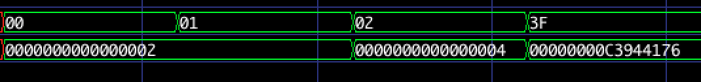

# 实验二、寄存器文件

_PB16001800 吴昊_

## 实验目的

- 熟练掌握时序逻辑电路设计方法
- 熟练掌握寄存器文件的实现原理

## 实验内容

设计一64*32bit的寄存器文件，即64个32位的寄存器文件（寄存器组）

- 具备一组读端口及一组写端口
- 通过读端口可从0~31号的任意地址读取数据
- 通过写端口可向0~31号的任意地址写入数据
- 寄存器的复位值可自行指定

## 实验功能要求

### 调用实验一ALU，完成以下功能

寄存器文件组r0,r1初始化为2，2，其他所有寄存器初始化为0
在clk控制下，依次完成以下计算，注意每个clk至多允许完成一次计算
r0+r1->r2
r1+r2->r3
r2+r3->r4
……
r61+r62->r63

### 结果在仿真中显示

## 实验过程
1. 首先设计一个寄存器文件，读端口直接和寄存器数组连接，写端口用时钟驱动
2. 实例化上一个实验中的 ALU
3. 写一个 top.v 文件，用状态机来控制斐波那契数列的生成
其中状态机部分代码如下：
```verilog
case(cycle)
    0:begin
        alu_in_a <= reg_rDout;
        reg_rAddr <= reg_rAddr + 1;
        cycle <= 1;
        end
    1:begin
        alu_in_b <= reg_rDout;
        cycle <= 2;
        end
    2:begin
        reg_wDin <= alu_out;
        cycle <= 3;
    end
    3:begin
        reg_wEna <= 1;
        cycle <= 4;
    end
    4:begin
        reg_wEna <= 0;
        reg_wAddr <= reg_wAddr + 1;
        cycle <= 0;
        calc_index <= calc_index + 1;
    end
```
### 实验结果



如图，第一排是寄存器编号，第二排是寄存器对应存放的数字

0x00 对应 0x02

0x01 对应 0x02

0x02 对应 0x04

0x3f 对应 0xc3944176

而使用Python计算真正的斐波那契数列（2，2为开始两项），得到第63项（0x3f项）结果是：0x134cc3944176

略有不同，是因为我们设计的寄存器是32bit的，超过32bit的部分由于溢出，不会得到保留

Python代码如下：

```python
a = [2, 2]
# range(62)有62项，是64项斐波那契数列去掉前两项
for i in range(62):
    a.append(a[-2] + a[-1]) 	# 新元素等于最后一个元素加倒数第二个元素
a = [hex(x) for x in a]		   # 将 a 中所有元素转化为十六进制
print(a)					  # 查看 a 的结果
```

## 实验源代码

alu.v

```verilog
module alu(
           input signed [31:0] alu_a,
           input signed [31:0] alu_b,
           input [4:0]         alu_op,
           output reg [31:0]   alu_out
           );
   parameter A_NOP = 5'h00;
   parameter A_ADD = 5'h01;
   parameter A_SUB = 5'h02;
   parameter A_AND = 5'h03;
   parameter A_OR = 5'h04;
   parameter A_XOR = 5'h05;
   parameter A_NOR = 5'h06;
always @(*)
  begin
   case(alu_op)
     A_ADD: alu_out = alu_a + alu_b;
     A_SUB: alu_out = alu_a - alu_b;
     A_AND: alu_out = alu_a & alu_b;
     A_OR: alu_out = alu_a | alu_b;
     A_XOR: alu_out = alu_a ^ alu_b;
     A_NOR: alu_out = alu_a ^~ alu_b;
     default: alu_out = 32'h0;
   endcase // case (alu_op)
  end // always @ (*)
endmodule // alu
```

----

reg_file.v

```verilog
module reg_file(
                input         clk,
                input         rst_n,
                input [5:0]   rAddr,
                output [63:0] rDout,
                input [5:0]   wAddr,
                input [63:0]  wDin,
                input         wEna
                );

   reg [31:0]                 regs [0:63];

   assign rDout = regs[rAddr];

   integer                 index;

   always@(posedge clk or negedge rst_n)
     begin
        if(~rst_n)
          begin
             for (index = 0; index < 64; index = index + 1)
               begin
                  regs[index] <= 0;
               end
             regs[0] <= 2;
             regs[1] <= 2;
          end
        else
          begin
             regs[wAddr] <= wEna ? wDin : regs[wAddr];
          end
     end // always@ (posedge clk or negedge rst_n)
endmodule // reg_file
```

----

top.v

```verilog
module top(
           input         clk,
           input         rst_n,
           output reg    rReady,
           input [5:0]   rAddr,
           output reg [63:0] rDout
);
   reg [31:0]    alu_in_a;
   reg [31:0]    alu_in_b;
   wire [31:0]   alu_out;

   // register file inputs and outputs configuration
   reg [5:0]     reg_rAddr;
   reg [5:0]     reg_wAddr;
   wire [63:0]   reg_rDout;
   //reg [63:0]   reg_rDout;
   reg [63:0] reg_wDin;
   reg        reg_wEna = 0;
   // config end

   // alu operator
   parameter op = 5'h1;

   // temp reg
   reg [63:0] r1;
   reg [63:0] r2;
   reg [63:0] r3;

   alu myalu(alu_in_a, alu_in_b, op, alu_out);
   reg_file myregfile(clk, rst_n, reg_rAddr, reg_rDout, reg_wAddr, reg_wDin, reg_wEna);

   integer i = 0;
   integer calc_index = 0;
   integer cycle = 0;

   always@(posedge clk or negedge rst_n)
     begin
        if(~rst_n)
          begin
             rReady <= 0;
             calc_index <= 0;
             reg_rAddr <= 0;
             reg_wAddr <= 2;
             cycle <= 0;
          end // if (~rst_n)
        else
          begin
             if (calc_index <= 61)
               begin
                  case(cycle)
                    0:begin
                       alu_in_a <= reg_rDout;
                       reg_rAddr <= reg_rAddr + 1;
                       cycle <= 1;
                      end
                    1:begin
                       alu_in_b <= reg_rDout;
                       cycle <= 2;
                      end
                    2:begin
                       reg_wDin <= alu_out;
                       cycle <= 3;
                    end
                    3:begin
                       reg_wEna <= 1;
                       cycle <= 4;
                    end
                    4:begin
                       reg_wEna <= 0;
                       reg_wAddr <= reg_wAddr + 1;
                       cycle <= 0;
                       calc_index <= calc_index + 1;
                    end
                  endcase // case (cycle)
               end // if (calc_index <= 61)
             else
               begin
                  rReady = 1;
                  reg_rAddr = rAddr;
                  rDout = reg_rDout;
               end // else: !if(calc_index <= 61)
          end // else: !if(~rst_n)
     end // always@ (posedge clk or negedge rst_n)
endmodule // top
```

----

testbench.v

```verilog
module regfile_fib_testbench;
   reg clk = 0;
   reg rst_n;
   wire rReady;
   reg [5:0] rAddr;
   wire [63:0] rDout;

   top mytop(clk, rst_n, rReady, rAddr, rDout);

   integer cycle;

   always@(posedge rReady)
     begin
        for (cycle = 0; cycle < 100; cycle = cycle + 1)
          begin
             #1;
             clk = ~clk;
          end
     end

   initial
     begin
        $dumpfile("testbench.vcd");
        $dumpvars;
        rst_n = 0;
        #100;
        rst_n = 1;
        while(~rReady)
          begin
             #1;
             clk = ~clk;
          end
        if (rReady)
          begin
             #10;
             rAddr = 0;
             #10;
             rAddr = 1;
             #10;
             rAddr = 2;
             #10;
             rAddr = 63;
          end // if (rReady)
     end // initial begin
endmodule // regfile_fib_testbench
```

